---
## Front matter
title: "Отчет по лабораторной работе № 3"
subtitle: "Архитектура компьютеров"
subtitle: "НММбд-03-22"
author: "Преснякова Вероника Борисовна" 

## Generic otions
lang: ru-RU
toc-title: "Содержание"

## Bibliography
bibliography: bib/cite.bib
csl: pandoc/csl/gost-r-7-0-5-2008-numeric.csl

## Pdf output format
toc: true # Table of contents
toc-depth: 2
lof: true # List of figures
fontsize: 12pt
linestretch: 1.5
papersize: a4
documentclass: scrreprt
## I18n polyglossia
polyglossia-lang:
  name: russian
  options:
	- spelling=modern
	- babelshorthands=true
polyglossia-otherlangs:
  name: english
## I18n babel
babel-lang: russian
babel-otherlangs: english
## Fonts
mainfont: PT Serif
romanfont: PT Serif
sansfont: PT Sans
monofont: PT Mono
mainfontoptions: Ligatures=TeX
romanfontoptions: Ligatures=TeX
sansfontoptions: Ligatures=TeX,Scale=MatchLowercase
monofontoptions: Scale=MatchLowercase,Scale=0.9
## Biblatex
biblatex: true
biblio-style: "gost-numeric"
biblatexoptions:
  - parentracker=true
  - backend=biber
  - hyperref=auto
  - language=auto
  - autolang=other*
  - citestyle=gost-numeric
## Pandoc-crossref LaTeX customization
figureTitle: "Рис."
tableTitle: "Таблица"
listingTitle: "Листинг"
lofTitle: "Список иллюстраций"
lolTitle: "Листинги"
## Misc options
indent: true
header-includes:
  - \usepackage{indentfirst}
  - \usepackage{float} # keep figures where there are in the text
  - \floatplacement{figure}{H} # keep figures where there are in the text
---

# Цель работы

Целью работы является изучить идеологию и применение средств 
контроля версий. Приобрести практические навыки по работе с системой git.

# Задание

1. Настроить github
2. Выполнить базовую настройку git
3. Создать SSH ключ
4. Создать рабочее пространство на основе шаблона
5. Создать репозиторий курса на основе шаблона
6. Настроить каталог курса
7. Выполнить задание для самостоятельной работы

# Выполнение лабораторной работы

## Настройка github

Создали учетную запись в Github.Затем в терминале сделали предварительную
конфигурацию git,т.е. ввели имя и email владельца репозитория. (рис. [-@fig:001])

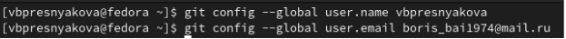{ #fig:001 width=70% }

Настроили utf-8 в выводе сообщений git. (рис. [-@fig:002])

{ #fig:002 width=70% }

Задали имя начальной ветки master. (рис. [-@fig:003])

{ #fig:003 width=70% }

Сделали параметры autocrlf и safecrlf. (рис. [-@fig:004]), (рис. [-@fig:005])

{ #fig:004 width=70% }

{ #fig:005 width=70% }

## Создание SSH ключа

Для последующей идентификации пользователя на сервере репозиториев
сгенерировали пару SSH ключей (приватный и открытый) в каталоге /.ssh/. (рис. [-@fig:006])

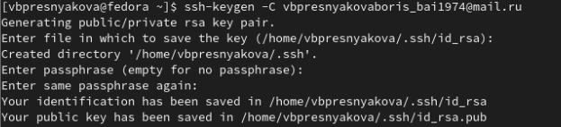{ #fig:006 width=70% }

С помощью команды cat вывели данные из каталога ~/.ssh/.Скопировали из консоли ключ в буфер обмена. (рис. [-@fig:007])

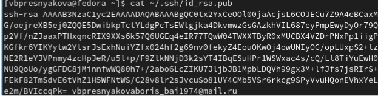{ #fig:007 width=70% }

Затем добавили сгенерированyый открытый ключ в настройках git. (рис. [-@fig:008])

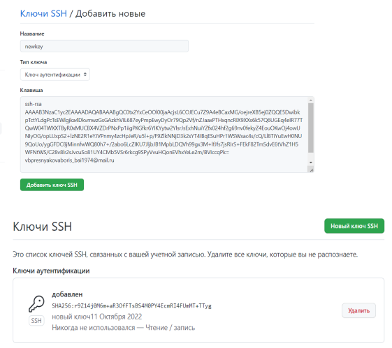{ #fig:008 width=70% }

## Сознание рабочего пространства и репозитория курса на основе шаблона

Создали каталог для предмета «Архитектура компьютера» в такой иерархии. (рис. [-@fig:009])

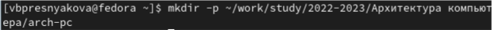{ #fig:009 width=70% }

Перешли на страницу репозитория с шаблоном курса. Выбрали use this template. (рис. [-@fig:010])

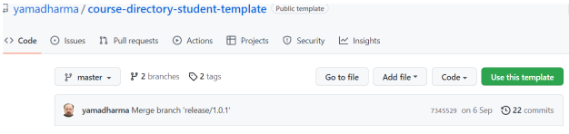{ #fig:010 width=70% }

Затем во всплывшем окне создали репозиторий с именем study_2022-2023_arch-pc. (рис. [-@fig:011])

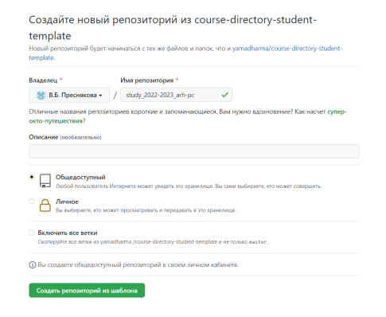{ #fig:011 width=70% }

Клонировали созданный репозиторий с помощью команды git clone и ссылки для
клонирования на странице созданного репозитория. (рис. [-@fig:012])

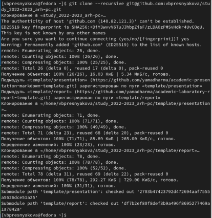{ #fig:012 width=70% }

## Настройка каталога курса

Перешли в каталог курса и удалили лишние файлы с помощью команды rm. (рис. [-@fig:013])

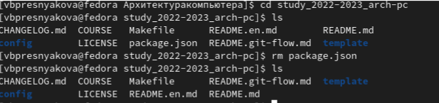{ #fig:013 width=70% }

Создали необходимые каталоги COURSE с помощью команды echo. (рис. [-@fig:014])

{ #fig:014 width=70% }

Сохранили все сделанные изменения на сервер,пояснили и отправили в центральный
репозиторий. (рис. [-@fig:015])

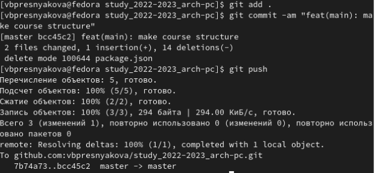{ #fig:015 width=70% }

## Задание для самостоятельной работы

Создали отчет по выполнению лабораторной работы в 
соответствующем каталоге рабочего пространства (labs>lab03>report) (рис. [-@fig:016])

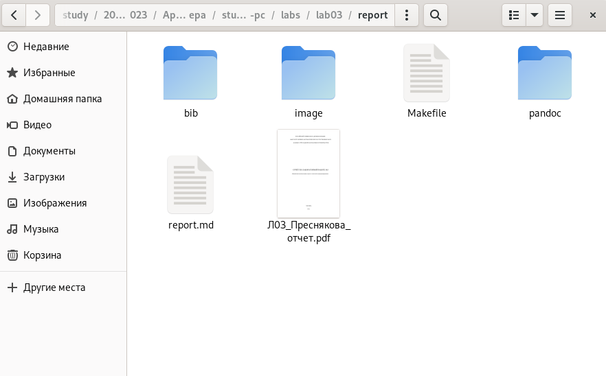{ #fig:016 width=70% }

Скопировали отчеты по выполнению предыдущих лабораторных работ 
в соответствующие каталоги созданного рабочего пространства. (рис. [-@fig:017]), (рис. [-@fig:018])

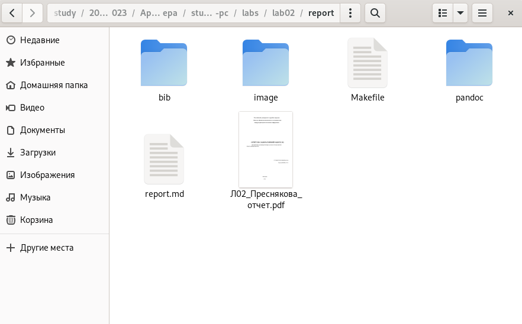{ #fig:017 width=70% }

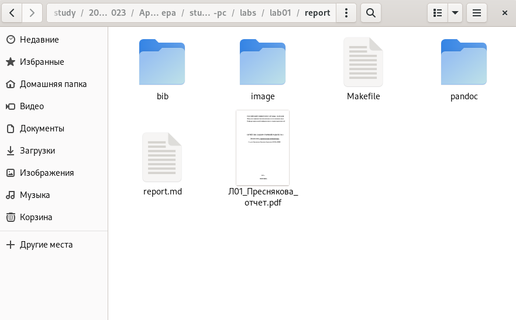{ #fig:018 width=70% }

Загрузили файлы на github. (рис. [-@fig:019]), (рис. [-@fig:020]), (рис. [-@fig:021]), (рис. [-@fig:022])

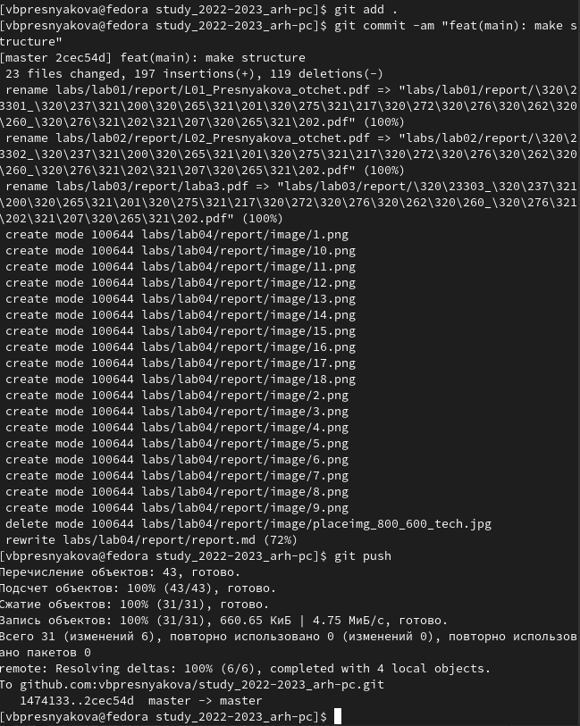{ #fig:019 width=70% }

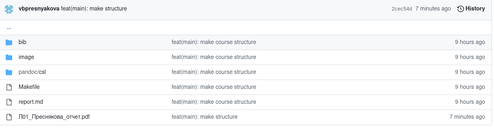{ #fig:020 width=70% }

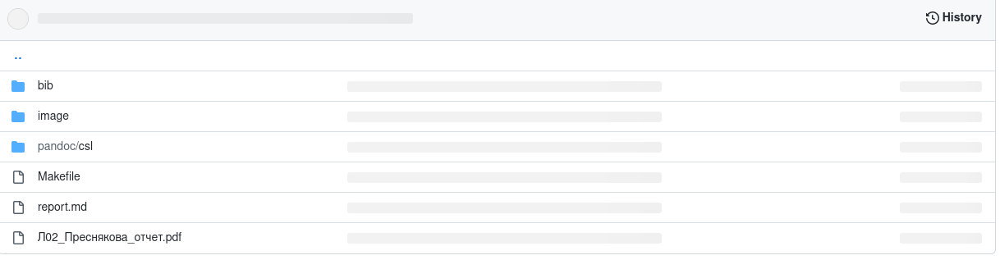{ #fig:021 width=70% }

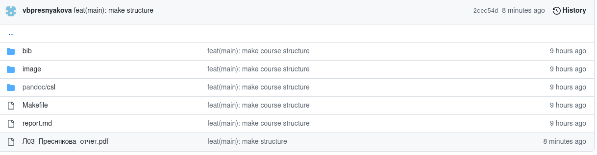{ #fig:022 width=70% }

# Выводы

При выполнении лабораторной работы были изучены идеология и применение средств 
контроля версий. Приобретены практические навыки по работе с системой git.

