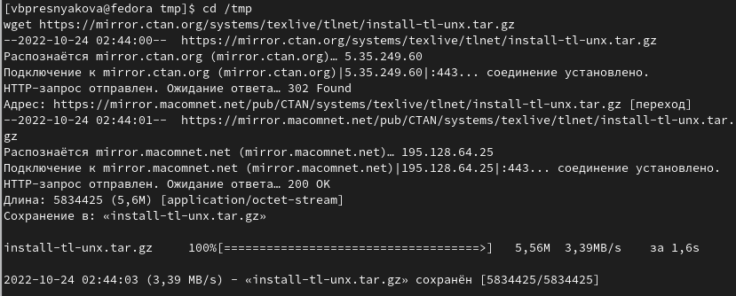
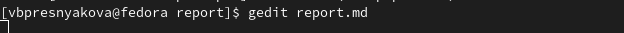

---
## Front matter
title: "Отчет по лабораторной работе № 4"
subtitle: "Архитектура компьютеров"
subtitle: "НММбд-03-22"
author: "Преснякова Вероника"

## Generic otions
lang: ru-RU
toc-title: "Содержание"

## Bibliography
bibliography: bib/cite.bib
csl: pandoc/csl/gost-r-7-0-5-2008-numeric.csl

## Pdf output format
toc: true # Table of contents
toc-depth: 2
lof: true # List of figures
fontsize: 12pt
linestretch: 1.5
papersize: a4
documentclass: scrreprt
## I18n polyglossia
polyglossia-lang:
  name: russian
  options:
	- spelling=modern
	- babelshorthands=true
polyglossia-otherlangs:
  name: english
## I18n babel
babel-lang: russian
babel-otherlangs: english
## Fonts
mainfont: PT Serif
romanfont: PT Serif
sansfont: PT Sans
monofont: PT Mono
mainfontoptions: Ligatures=TeX
romanfontoptions: Ligatures=TeX
sansfontoptions: Ligatures=TeX,Scale=MatchLowercase
monofontoptions: Scale=MatchLowercase,Scale=0.9
## Biblatex
biblatex: true
biblio-style: "gost-numeric"
biblatexoptions:
  - parentracker=true
  - backend=biber
  - hyperref=auto
  - language=auto
  - autolang=other*
  - citestyle=gost-numeric
## Pandoc-crossref LaTeX customization
figureTitle: "Рис."
tableTitle: "Таблица"
listingTitle: "Листинг"
lofTitle: "Список иллюстраций"
lolTitle: "Листинги"
## Misc options
indent: true
header-includes:
  - \usepackage{indentfirst}
  - \usepackage{float} # keep figures where there are in the text
  - \floatplacement{figure}{H} # keep figures where there are in the text
---

# Цель работы

Целью работы является освоение процедуры оформления отчетов с помощью
легковесного языка разметки Markdown.

# Задание

1. Освоить процедуры оформления отчетов с помощью
легковесного языка разметки Markdown.
2. В соответствующем каталоге сделать отчёт по лабораторной работе № 4
в формате Markdown.
3. В соответствующем каталоге сделать отчёт по лабораторной работе № 3
в формате Markdown. В качестве отчёта предоставить отчёты
в 3х форматах: pdf, docx и md.
4. Загрузить файлы на github.

# Выполнение лабораторной работы

## Установка Pandoc и pandoc-crossref

Скачали архивы с исходными файлами pandoc (https://github.com/jgm/pandoc/releases:).
(рис. [-@fig:006])

{ #fig:006 width=70% }

Скачать архив pandoc-crossref (https://github.com/lierdakil/pandoccrossref/releases:).
(рис. [-@fig:007])

{ #fig:007 width=70% }

Распаковали архивы. рис. ([-@fig:008])

{ #fig:008 width=70% }

Скопировали файлы pandoc и pandoc-crossref в каталог /usr/local/bin/.
С помощью команды ls можно проверили корректность выполненных действий. (рис. [-@fig:009])

{ #fig:009 width=70% }

## Установка TeX Live

На странице официального сайта TeX Live https://www.tug.org/texlive/acqu
ire-netinstall.html скачали архив install-tl-unx.tar.gz. (рис. [-@fig:001])

{ #fig:001 width=70% }

Распаковали архив. (рис. [-@fig:002])

{ #fig:002 width=70% }

Перешли в распакованную папку. (рис. [-@fig:003])

{ #fig:003 width=70% }

Запустили скрипт install-tl c root правами.

Добавили /usr/local/texlive/2022/bin/x86_64-linux в PATH для текущей и будущих сессий.
(рис. [-@fig:005])

{ #fig:005 width=70% }

## Оформление отчёта в формате Markdown

Открыли терминал и перешли в каталог курса, сформированный при выполнении лабораторной
работы №3. (рис. [-@fig:010])

{ #fig:010 width=70% }

Обновили локальный репозиторий, скачав изменения из удаленного репозитория с помощью
команды. (рис. [-@fig:011])

{ #fig:011 width=70% }

Перешли в каталог с шаблоном отчета по лабораторной работе № 4. (рис. [-@fig:012])

{ #fig:012 width=70% }

Проверили компиляцию шаблона с использованием Makefile. Для этого ввели команду make.
(рис. [-@fig:013])

{ #fig:013 width=70% }

Открыли и проверили корректность полученных файлов. (рис. [-@fig:014])

{ #fig:014 width=70% }

Удалили полученные файлы с использованием Makefile. Для этого ввели команду make clean.
(рис. [-@fig:015])

{ #fig:015 width=70% }

Проверили, что после этой команды файлы report.pdf и report.docx были удалены.
(рис. [-@fig:016])

{ #fig:016 width=70% }

Открыли файл report.md c помощью текстового редактора gedit. (рис. [-@fig:017])

{ #fig:017 width=70% }

Заполнили отчет и скомпилировали отчет с использованием Makefile. (рис. [-@fig:018])

{ #fig:018 width=70% }

Загрузили файлы на Github. (рис. [-@fig:019])

{ #fig:019 width=70% }

## Задание для самостоятельной работы

1. В соответствующем каталоге сделайли отчёт по лабораторной работе № 3
в формате Markdown. В качестве отчёта предоставили отчёты
в 3х форматах: pdf, docx и md. (рис. [-@fig:020]), (рис. [-@fig:021])

{ #fig:020 width=70% }

{ #fig:021 width=70% }

2. Загрузили файлы на Github. (рис. [-@fig:022])

{ #fig:022 width=70% }

# Выводы

В ходе лабораторной работы были освоены процедуры оформления отчетов с помощью
легковесного языка разметки Markdown.

